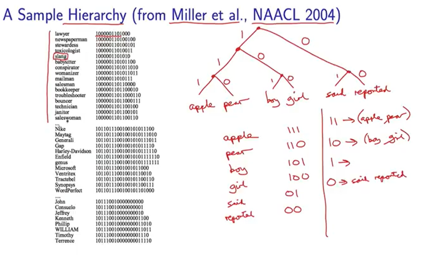

# Mode d'emploi du lancement de la clusterisation Brown

```bash
git clone https://bitbucket.org/soegaard/aave-pos16.git
cd aave-pos16/resources/clusters/brown-master

# Clusters input.txt into 50 clusters:
./wcluster --text input.txt --c 50
# Output in input-c50-p1.out/paths
```

Pour avoir une visualisation HTML plus claire : 

```bash
./cluster-viewer/build-viewer.sh corpus.out/paths
```

# Explication sur le fonctionnement de la hiérarchie Brown

>Brown clustering is a hard hierarchical agglomerative clustering problem based on distributional information proposed by Peter Brown, William A. Brown, Vincent Della Pietra, Peter V. de Souza, Jennifer Lai, and Robert Mercer.[1] It is typically applied to text, grouping words into clusters that are assumed to be semantically related by virtue of their having been embedded in similar contexts. (Wikipédia)

CM par un prof de Columbia University sur le Brown clustering : https://www.youtube.com/playlist?list=PLlQBy7xY8mbLLALDjL2R-r2dxV42IABP1



Notes : 

- Ressemble beaucoup aux HMM
- Algorithme déterministe
- Il faut avoir un corpus de plusieurs millions de mots
- De manière générale, on choisit de faire autour de 1000 clusters


A FAIRE : 

- [ ] Essayer de régler le problème avec le script `make_html.py`
- [ ] Finir de regarder le CM