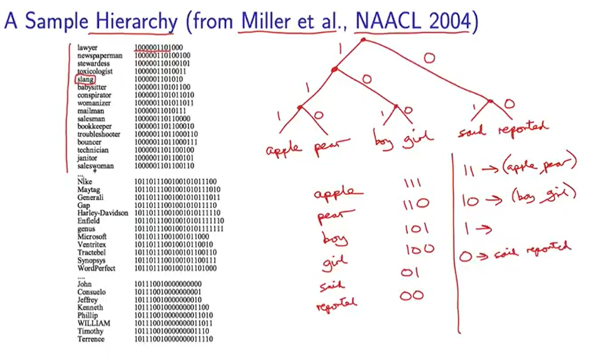

# Mode d'emploi du lancement de la clusterisation Brown

```bash
git clone https://bitbucket.org/soegaard/aave-pos16.git
cd resources/clusters/brown-master

# Clusters input.txt into 50 clusters:
./wcluster --text input.txt --c 50
# Output in input-c50-p1.out/paths
```

`input.txt` doit être du texte brut. On peut utiliser le script `extraction.py` du module `dendoun` pour récupérer le texte des coNLL. 

Pour avoir une visualisation HTML plus claire, il faut lancer le script `build-viewer.sh` qui se trouve sur *notre* github : 

```bash
./cluster-viewer/build-viewer.sh corpus.out/paths
```

Le résultat se trouve dans `clusters/cluster_viewer.html`. (Le code que j'ai utilisé provient de [ce GitHub](https://bitbucket.org/soegaard/aave-pos16.git).  J'ai un peu modifié le script `make_html.py` d'origine parce qu'il était écrit en Python 2).

EDIT : Je crois que l'implémentation de l'algorithme de Brown vient originellement de ce Github : https://github.com/percyliang/brown-cluster

# Explication sur le fonctionnement de la hiérarchie Brown

>Brown clustering is a hard hierarchical agglomerative clustering problem based on distributional information proposed by Peter Brown, William A. Brown, Vincent Della Pietra, Peter V. de Souza, Jennifer Lai, and Robert Mercer.[1] It is typically applied to text, grouping words into clusters that are assumed to be semantically related by virtue of their having been embedded in similar contexts. (Wikipédia)

CM par un prof de Columbia University sur le Brown clustering : https://www.youtube.com/playlist?list=PLlQBy7xY8mbLLALDjL2R-r2dxV42IABP1



Notes : 

- Ressemble beaucoup aux HMM
- Algorithme déterministe
- Il faut avoir un corpus de plusieurs millions de mots
- De manière générale, on choisit de faire autour de 1000 clusters

# Résultats

Les résutats semblent ne pas être fifous. Je pense que c'est parce que notre corpus est trop petit et aussi pas nettoyé (@USER et @URL). Il faudrait réessayer en nettoyant les données et en augmentant avec de l'anglais. Mais je pense que même en nettoyant, ça donnera rien vu que c'est vraiment trop petit notre corpus.

EDIT : on a trouvé une hiérarchie faite par ARK sur 50 millions de tweets : http://www.cs.cmu.edu/~ark/TweetNLP/#resources

A FAIRE : 

- [x] Essayer de régler le problème avec le script `make_html.py`
- [ ] Finir de regarder le CM
- [ ] essayer de voir si je peux augmenter les données ? 
- [ ] regarder comment utiliser les clusters pour le pos tagging